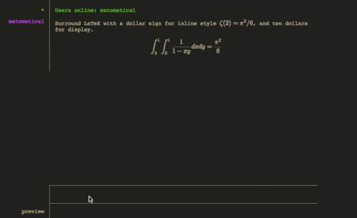

# HackChat+

This is a self-signed Firefox add-on which adds additional KaTeX functionality to the cool chat website hack.chat.

This thing is really held together using paper clips and rubber bands and small changes to hack.chat may break it. It's my first browser extension and also my first time really using javascript so please go easy on me.

## Features

* Import the 'Copy-Tex' KaTeX extension, which imo hack.chat should just do itself.
* Add a 'message preview' below the message input textarea, which shows rendered the message as it will be rendered using KaTeX.
    - LaTeX errors encountered when parsing the message should be visible in the console.
    - Currently the preview is always-on, which is probably a bit annoying if you don't use any LaTeX in your messages (so your plain-text message is just displayed twice). TODO: maybe show the preview only when there's some LaTeX inside the message, or with a button or menu option, or something.

## Demo

---

Made with :purple_heart: by Matt.